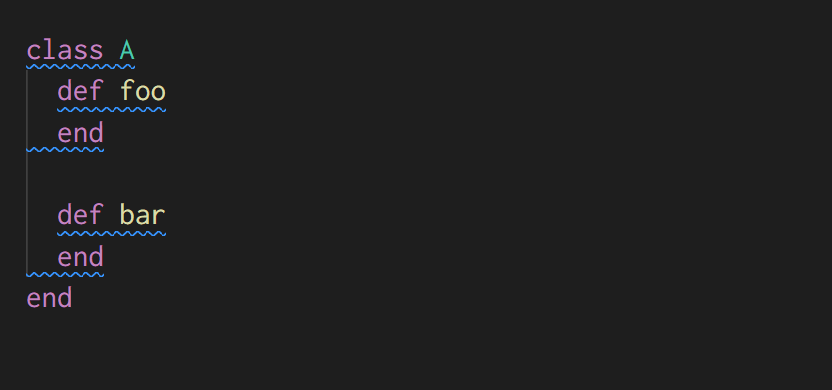
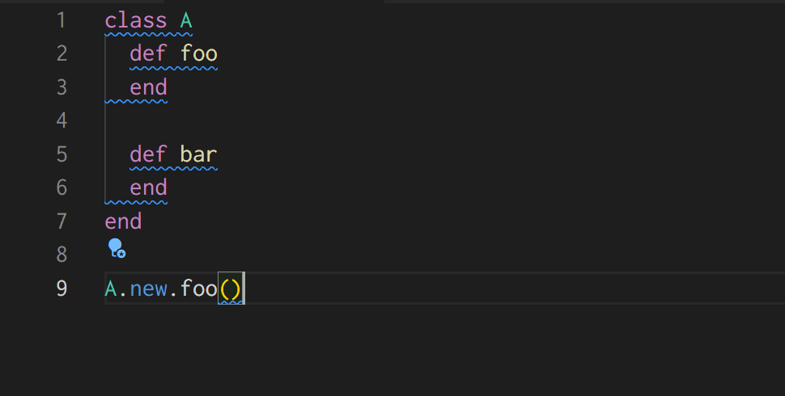

# vscode-ruby-light

Lightweight VSCode extension for Ruby.

This extension is intended to provide a slightly better editing experience than VSCode's standard features, such as better syntax highlighting and better cursor manipulation, without requiring users to install Ruby.

## Install

Install via Visual Studio Marketplace:

- [Ruby Light - Visual Studio Marketplace](https://marketplace.visualstudio.com/items?itemName=r7kamura.vscode-ruby-light)

### Optional configuration

If you want to use Diagnostics and Formatting features, `rubocop` must be available in your VSCode workspace. If `Gemfile` exists in the workspace or any ancestor directory, `bundle exec rubocop` is used instead. For the other features, there is no need to install anything additional.

If you want to partially disable any of the features provided by this extension, you can do so in the Settings menu.

## Features

### Diagnostics

Displays RuboCop offenses and provides Quick Fix command for autocorrection.

### Formatting

Run "Format Document" command or enable "Format On Save" in the settings to autocorrect RuboCop offenses.

### Highlight

Hover control keywords to highlight the corresponding keywords.

### Selection

Run "Expand Selection" command to select appropriate ranges.

### Symbol

Show Outline section in the explorer panel to see symbols in the current file, or run "Go to Symbol" command to search for symbols.

This extension supports the folowiing types of symbols:

- class
- module
- constant
- instance method
- singleton method (a.k.a. class method)
- attribute (attr_accessor, attr_reader, and attr_writer)

### Others

- Add Ruby file extension patterns
- Add Ruby file name patterns
- Add indentation rules

## Configuration

### `rubyLight.diagnostics.enabled`

Enable diagnostics.

- default: `true`

### `rubyLight.documentFormatting.enabled`

Enable document formatting and document range formatting.

- default: `true`

### `rubyLight.documentHighlight.enabled`

Enable document highlight.

- default: `true`

### `rubyLight.selectionRanges.enabled`

Enable selection ranges.

- default: `true`

### `rubyLight.documentSymbol.enabled`

Enable document symbol.

- default: `true`

## Acknowledgements

- Inspired by [rubyide/vscode-ruby](https://github.com/rubyide/vscode-ruby)
- Powered by [ruby/prism](https://github.com/ruby/prism)'s Ruby parser
