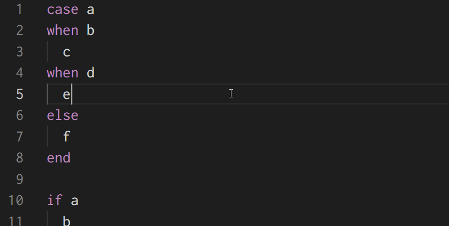
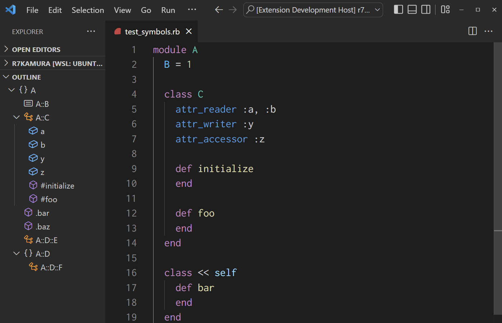
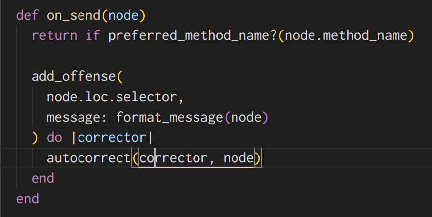

# vscode-ruby-light

Lightweight VSCode extension for Ruby.

## Install

Install via Visual Studio Marketplace:

- [Ruby Light - Visual Studio Marketplace](https://marketplace.visualstudio.com/items?itemName=r7kamura.vscode-ruby-light)

## Features

### Document Highlight

For control structures, highlight the corresponding keywords when pointing to them.

### Document Symbol

With this information, editors can display breadcrumbs and file outlines, and allow for fuzzy symbol searches by [Go to Symbol](https://code.visualstudio.com/docs/editor/editingevolved#_go-to-symbol) command.

> You can navigate symbols inside a file with <kbd>Ctrl + Shift + O</kbd>. By typing `:` the symbols will be grouped by category. Press <kbd>Up</kbd> or <kbd>Down</kbd> and navigate to the place you want.

This extension supports the folowiing types of symbols:

- class
- module
- constant
- instance method
- singleton method (a.k.a. class method)
- attribute (attr_accessor, attr_reader, and attr_writer)

### Selection Ranges

Select the appropriate ranges when the VSCode's "Expand Selection" command is triggered.

This command has the following shortcut keys assigned by default:

- <kbd>Ctrl + Shift + ArrowRight</kbd> on Mac
- <kbd>Ctrl + Alt + ArrowRight</kbd> on Windows
