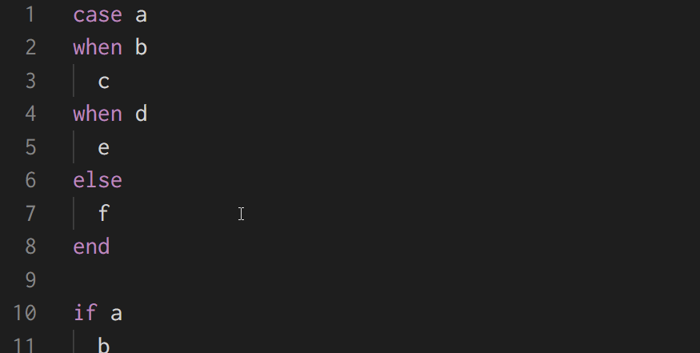

# vscode-ruby-light

Lightweight VSCode extension for Ruby.

## Install

Install via Visual Studio Marketplace:

- [Ruby Light - Visual Studio Marketplace](https://marketplace.visualstudio.com/items?itemName=r7kamura.vscode-ruby-light)

## Features

### Diagnostics

Displays RuboCop offenses and provides Quick Fix command for autocorrection.

### Formatting

Run "Format Document" command or enable "Format On Save" in the settings to autocorrect RuboCop offenses.

### Highlight

Hover control keywords to highlight the corresponding keywords.

### Selection

Run "Expand Selection" command to select appropriate ranges.

### Symbol

Show Outline section in the explorer panel to see symbols in the current file, or run "Go to Symbol" command to search for symbols.

This extension supports the folowiing types of symbols:

- class
- module
- constant
- instance method
- singleton method (a.k.a. class method)
- attribute (attr_accessor, attr_reader, and attr_writer)

## Configuration

### `rubyLight.diagnostics.enabled`

Enable diagnostics.

- default: `true`

### `rubyLight.documentFormatting.enabled`

Enable document formatting.

- default: `true`

### `rubyLight.documentHighlight.enabled`

Enable document highlight.

- default: `true`

### `rubyLight.selectionRanges.enabled`

Enable selection ranges.

- default: `true`

### `rubyLight.documentSymbol.enabled`

Enable document symbol.

- default: `true`

## Acknowledgements

This extension is inspired by [vscode-ruby](https://github.com/rubyide/vscode-ruby).
